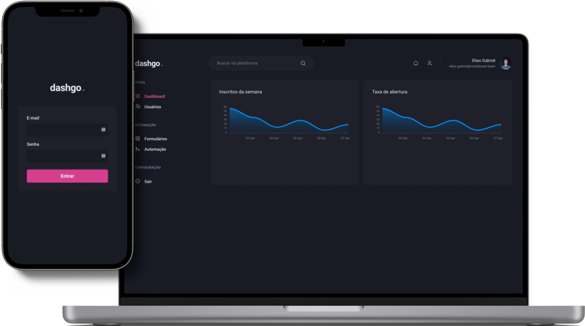

<h1 align="center">
  
</h1>

  
  

  <a href="#-technologies">Technologies</a> •
  <a href="#-license">License</a>

  

## 🚀 Technologies

- [ReactJS](https://reactjs.org/)
- [TypeScript](https://www.typescriptlang.org/)
- [Chakra UI](https://chakra-ui.com/)
- [Next.js](https://nextjs.org/)
- [React Hook Form](https://react-hook-form.com/)
- [React Query](https://react-query.tanstack.com/)
- [Mirage JS](https://miragejs.com/)

## 📝 License

This project is licensed under the MIT License - see the [LICENSE](LICENSE) file for details.

---

  Made with 💜&nbsp; by <a href="https://www.linkedin.com/in/eliasgcf/">Elias Gabriel</a>

